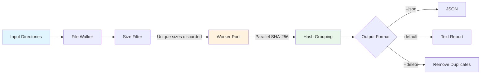
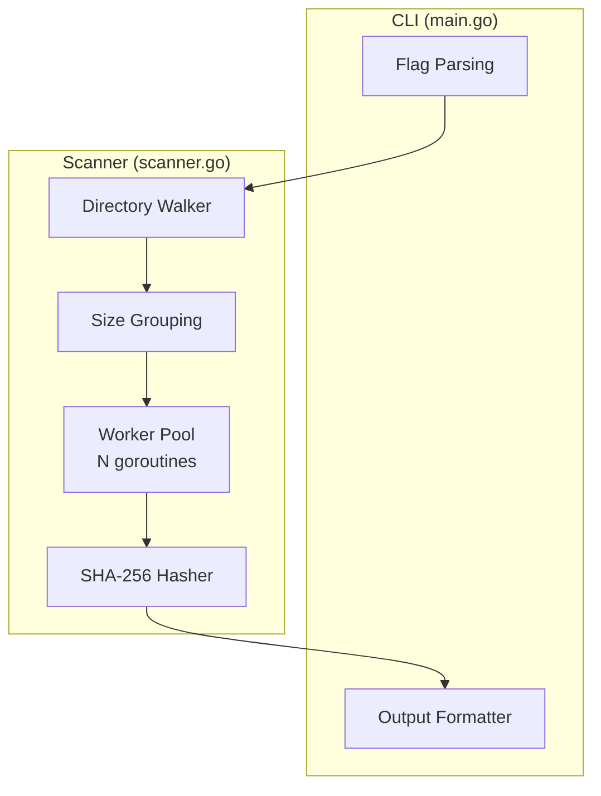

# dedup

A fast file deduplication finder written in Go. Identifies duplicate files across directories using content hashing with a parallel worker pool.

## Features

- **Fast**: Uses size-based pre-filtering and parallel hashing (xxhash + SHA-256)
- **Accurate**: SHA-256 content hashing eliminates false positives
- **Flexible**: Filter by file size, scan multiple directories
- **Multiple outputs**: Human-readable or JSON output
- **Safe deletion**: Dry-run mode to preview what would be removed

## Installation

```bash
go install github.com/AmirNaghibi/dedup@latest
```

Or build from source:

```bash
git clone https://github.com/AmirNaghibi/dedup.git
cd dedup
go build -o dedup .
```

## Usage

```bash
# Find duplicates in a directory
dedup ~/Photos

# Scan multiple directories
dedup ~/Downloads ~/Documents

# Only consider files larger than 1MB
dedup --min-size 1048576 /data

# JSON output for scripting
dedup --json ~/Music | jq '.[] | select(.size > 10000000)'

# Preview what would be deleted (keeps first file in each group)
dedup --delete --dry-run ~/Downloads

# Actually delete duplicates
dedup --delete ~/Downloads
```

## Options

| Flag | Description |
|------|-------------|
| `--min-size` | Minimum file size in bytes to consider |
| `--max-size` | Maximum file size in bytes (0 = no limit) |
| `--show-size` | Show file sizes in output |
| `--json` | Output results as JSON |
| `--delete` | Delete duplicates (keeps first file in each group) |
| `--dry-run` | Show what would be deleted without deleting |
| `--workers` | Number of parallel hash workers (0 = auto) |
| `--version` | Print version and exit |

## How It Works



**Pipeline stages:**

1. **Walk**: Recursively scans all target directories, collecting file metadata
2. **Size filter**: Groups files by size (files with unique sizes can't be duplicates)
3. **Hash**: Computes SHA-256 content hashes in parallel for size-matched candidates
4. **Group**: Files with identical hashes are reported as duplicate groups
5. **Report**: Results sorted by wasted space (largest groups first)

### Architecture



## Performance

The tool uses several optimizations:
- Size-based pre-filtering eliminates most unique files before any I/O
- Worker pool parallelizes disk reads across CPU cores
- 64KB read buffer balances memory usage and syscall overhead
- xxhash computed alongside SHA-256 (available for future partial-hash optimization)

## License

MIT
